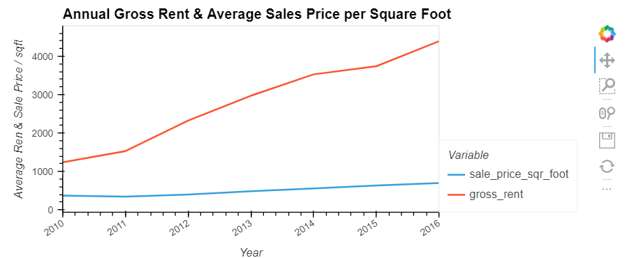
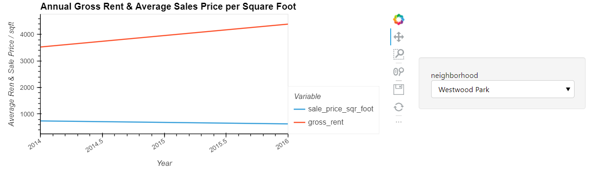
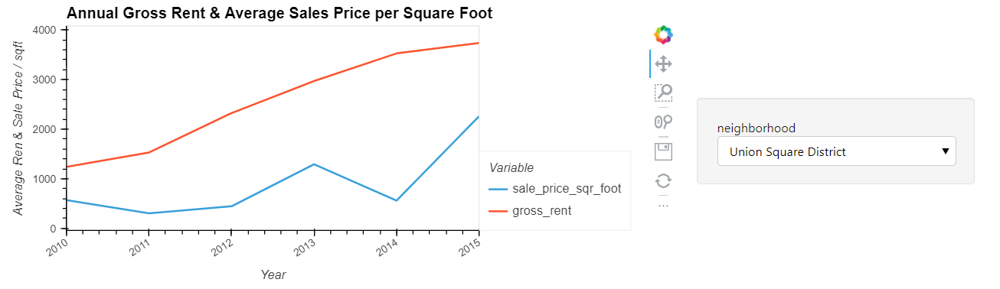

# San-Fran-Property-Investments
UW Fintech Module 6 Challenge  

Project was designed to have us analyze the San Francisco housing market (2010-2016), looking at the overall rental rates and price per square foot for sales.  We also took a look at metrics by neighborhoods to identify investment opportunities.

---

## Technologies

The following libraries are used in this analysis:  
  
  *  pandas  
  *  hvplot  
  *  matplotlib
  
---

## Purpose of Program

### Real-estate Trend Analysis  
  
The purpose of hte program is to evaluate the trends in real-este within the San Francisco market.  First we look at the number of available units and then the rental rates as well as the sale price per square foot.

Finally we break this down by neighborhood through visual analysis to identify areas of opportunity as well as determine if the trends we see at the city level are consistent throughout each of the neighborhoods.

---

## Conclusions

**Question:**  How does the trend in rental income growth compare to the trend in sales prices? Does this same trend hold true for all the neighborhoods across San Francisco?

**Answer:** As the image below shows, monthly rent growth rate is far outpacing the Sales Price per Square Foot:

Rent has nearly quadrupled while the sale price per square foot has only seen incremental growth.  There are certainly neighboorhoods that have seen greater growth than other, but for the most part all across the San Francisco market rate increases are outpacing the sale price per square foot.  
  
While the macro trend is showing rapidly groowing rent and slow growing sales prices, it is very neighborhood dependent.  For example one of the highest rent areas, Westwood Park is actually seeing the sale prices decrease while rent has been increasing.  This indicates that most of hte desirable properties have been bought and turned into rentals.  

conversely you are starting to see other neighborhoods starting to turn over from a sales perspective.  Union Square has seen a large increase in sale price per square foot from 2015 to 2016, with a growth rate higher than the rental rate growth.  This indicates that properties are being bought up and may be repurposed as rentals in the near future

**Question:** What insights can you share with your company about the potential one-click, buy-and-rent strategy that they're pursuing? Do neighborhoods exist that you would suggest for investment, and why?

**Answer:** The one click rent might be a good resource to make avaialble to customers.  Given the strong growth in rental rates it appears to be a competitive market and people need to move fast.  This seems to hold true for all neighborhoods.  The fact that the sale price per square foot has been so stagnant leads me to believe immediacy is not as much of a criteria so the one click might not be a solid product offering.

---

## Contributors

Special thanks to instructor (Gerit Hall), teaching assistants (Kyle Gee & Aarti Couture), and tutor (Katie Kirby) as well as classmate (Jason Buckholt) 

---

## License

Program is free to use without license.  Only request is that you notify author of use and application
